# Turtorial
In this tutorial I will show you how to reverse engineer a game(growtopia)


# Why?
In the game you can't open a multiple instances of the game, so that you can't play with multiple
accounts on the same device, so lets try to ***reverse engineer*** the game to achieve this functionality


# Requirements
To understand/follow along this article things listed here is required
- basic knowledge of x86 assembly 
- some knowledge about how if else statements work at the low level
- experience in [C programming language](https://en.wikipedia.org/wiki/C_(programming_language))
- [ghidra](https://github.com/NationalSecurityAgency/ghidra) software - Windows OS


# Issues and comments

- for feedback / comments about the article, go [here][article_comments_section_link]

- for people having problem / issue in the turtorial, go [here][article_issue_link]

# Turtorials
Before starting the turtorials, make sure to ***zoom in*** to have a better look at the image

## Turtorials Table Of contents
- [1.Overview](#1overview)
- [2.game and ghidra installation](#2game-and-ghidra-installation)
- [3.importing the game to ghidra](#3-importing-the-game-to-ghidra)
- [4.information gathering](#4-information-gathering)
- [5.binary analysis](#5-binary-analysis)
- [6.finding the code that prevent multiple instances](#6-finding-the-code-that-prevent-multiple-instances)
- [7.understanding the validator](#7-understanding-the-validator)
- [8.bypassing the validator](#8-bypassing-the-validator)
- [9.Exporting the program and testing it out](#9exporting-the-program-and-testing-it-out)

```
Notes : 
this functions names that I mentioned in the article, in the microsoft docs or by the ghidra decompiler are the same and interexchangeable
I mention this because the microsoft docs and the output from the ghidra decompiler are different in naming both of this functions

OpenMutexW == OpenMutexA
CreateMutexW == CreateMutexA
```
## 1.Overview

In this tutorial we will try to break the validator as shown in [Why? Section](#why) using [reverse engineering](https://en.wikipedia.org/wiki/Reverse_engineering) techniques
with the [ghidra framework][ghidra_link]

A common way and easy way to check if a windows program is running with multiple instances is by using 
the win32 api [CreateMutexA][CreateMutexA_link] and [OpenMutexW][OpenMutexW_link], 


this is a pseudo code of how the program achieve this
```
  // if OpenMutexA fails because no mutex object has been prevously created 
  // then it will return NULL 
  // so to check if multiple instances are running, it can be done this way
  // which won't create new mutex if the mutex has been created previously
  program_handle = OpenMutexA(0x1f0001,0,"Growtopia");
  if ((program_handle == (HANDLE)0x0))
	program_handle = CreateMutexA((LPSECURITY_ATTRIBUTES)0x0,0,"Growtopia");

```

We can remove the lock by trying to make an unconditional jump by patching the binary at 
```
  if ((program_handle == (HANDLE)0x0))
```
with ghidra's disassembler to jump straight to 

```
program_handle = CreateMutexA((LPSECURITY_ATTRIBUTES)0x0,0,"Growtopia");
```
So that It will initialize the game regardless if a mutex for "Growtopia" has been created or not

### Example Of Patching Binary Via Modifying The Assembly 


after the "lock" has been **disabled**, we can play Growtopia on multiple windows with multiple accounts simultaneously


## 2.Game And Ghidra Installation
Before starting this tutorial, we need to install both of the game and ghidra

### ghidra installation
head over to [ghidra][ghidra_installation_link] and look at the [installation guide](https://htmlpreview.github.io/?https://github.com/NationalSecurityAgency/ghidra/blob/stable/GhidraDocs/InstallationGuide.html)

To Install the exact versio  that I am using in this turtorial, go [here](https://github.com/NationalSecurityAgency/ghidra/releases/tag/Ghidra_10.1.2_build)
### growtopia installation

which can be installed [here][tutorial_resources] to install `SavedData.zip` then extract the zip to get the ***growtopia installer*** to install the game.

You can also install the ***official installer*** [here][growtopia_link] but the ***binary might differ***  from the turtorial

## 3. Importing the game to ghidra

1. open ***ghidra*** then go to ***file->New Project ...*** 

2. select ***Non-Shared Project*** then click next

3. now you need to specify the ***Project Directory*** and ***Project Name***
I will set my ***Project Directory*** as `C:\Users\Nicho\Desktop\cracking_blog\projects`
and my Project name as ***BreakTheLock***

4. After we have created the ghidra project we need to find the main ***executable*** of growtopia
- we can do that by first typing ***growtopia*** in the windows search bar


- we are brought to this folder, but it is only the location of the ***shortcut***
  so we need to right click at the shortcut once more and select ***open file location***


- we have sucessfully found the location of the main ***executable*** of growtopia


- import to ghidra by dragging the ***Growtopia.exe*** to the ghidra's project menu


- we are prompted this menu, we can just leave everything as default


	- we can also see the architecture of the executable by clicking the ***...*** besides ***Language*** menu

		- from the image above, we know that the game is compiled using [Visual Studio][visual_studio_link]  targeting the ***x86 architecture***

- after clicking ***ok*** we can begin importing the game to ghidra and wait until it finishes


- when the import is finished, we can see the ***summary/analysis*** of the binary

	- from the image above, we can see that ghidra seems to not know the specific visual studio's compiler
	  `Compiler: 			visualstudio:unknown`
	  (we need to find information about the specific compiler or what language the game is originally written in so that we can improve our reverse engineering effort)


## 4. Information gathering
Before we start ***reverse engineering*** the game, lets try to find the publicly available information about the game
like the source code's language the game written in, the library it uses and ect.

### finding the programming language the game is written in
Lets first try to find the github of the developers to guess the source code's language
to do that, we can head to the [wiki website of growtopia][growtopia_wikipedia_link]

>  Developed by Robinson Technologies and Hamumu Software until 2017.
>  Published by Robinson Technologies until 2017.


Looking at the page we can see that it is developed mainly by Robinson Technologies and Hamumu Software 

So lets try to find their github pages by searching for
```
robinson technologies github
```


when clicking the first result image we have found the [developer's github][rtsoft_github_link]


we can see from his github profile that he seems to like c++/c alot because he is using
it alot in his repositories

Now lets look at the first repositories that is shown which is [proton][proton_link]


We can see that growtopia is using the ***Proton SDK***, now we can conclude that it is likely
that growtopia on windows is written using ***c/c++*** and is using [winapi][win_api_wikipedia_link] to check for multiple instances

## 5. Binary Analysis
In this step we are going to analyze the program using the ***code viewer*** 
by double clicking ***Growtopia.exe***


Then we are brought to ***code viewer*** menu, which we will press ***yes*** to let ***ghidra*** analyze
, dissasemble and decompile the binary for us.


To get the function's parameters correctly for better ***decompilation result*** 
 we need to turn on the ***Decompiler Parameter Id*** option 


Click ***Apply*** then ***Analyze***, we can see the analysis's progress in the bottom right
, it might take a long time depending on the pc (It took about one hour on my pc for ghidra to analyze
the binary)


We can see a few ***warning***, but that is okay and we
can just close this windows. 


after the analysis is completed, we can get to the ***fun and actual reverse engineering stuff***


## 6. Finding The code that prevent multiple instances
In this step, we are going to try to find the code in the binary that performs the ***check***

To do that, let's first look at the message when we open multiple windows of growtopia.


in the popup windows above it said `An instance of Growtopia is already running! Go play that one.`
We can see that the popup windows is using some kind of [win api][win_api_wikipedia_link] 
Which if we can take an educated guess, the program might use [MessageBoxA function][MessageBoxA_link]
to display that message to us.

So, lets take a look at the function signature From the [documentation][MessageBoxA_link] 

> Displays a modal dialog box that contains a system icon, a set of buttons, and a 
> brief application-specific message, such as status or error information. 
> The message box returns an integer value that indicates which button the user clicked.

and it has the signature as following
```
int MessageBoxA(
  [in, optional] HWND   hWnd,
  [in, optional] LPCSTR lpText,
  [in, optional] LPCSTR lpCaption,
  [in]           UINT   uType
);
```
so for the program to display that ***message box*** the string 
`An instance of Growtopia is already running! Go play that one.` is passed to the parameter
`lpCaption`.

With that information we will try to find where ***the string*** is used in the program (more specifically by the 
[MessageBoxA][MessageBoxA_link]) then try to trace back what causes that function to be executed.


So, lets try to do that!

- Open the ***window***  menu to get the ***defined strings menu*** so we can look at all 
the strings that the program used, by going to ***Windows->Defined Strings***
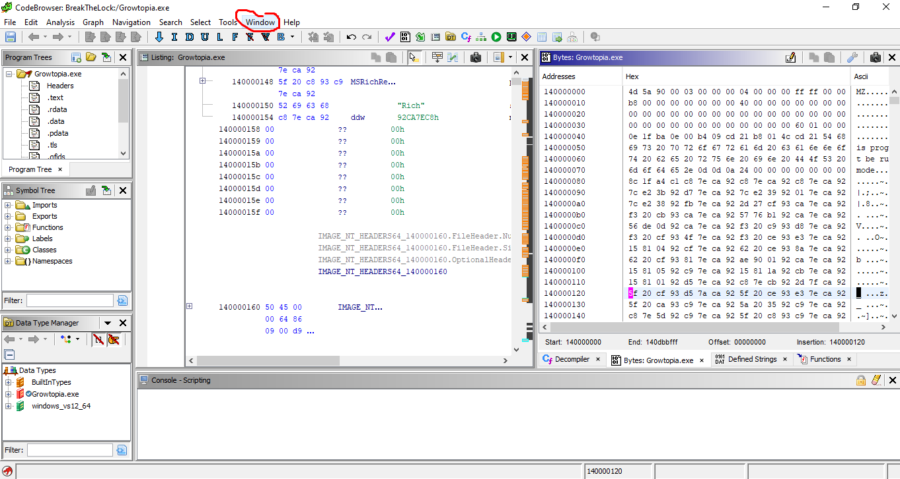
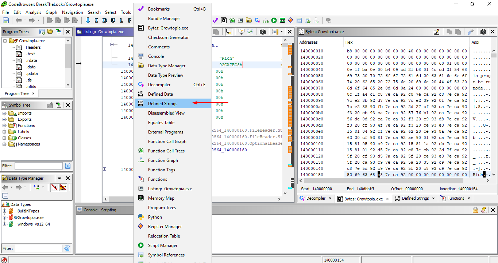

- Using the ***Defined Strings menu*** we will search for ***an instance of*** 
  after a few words are typed we can see that ***ghidra*** has found the strings in the program.
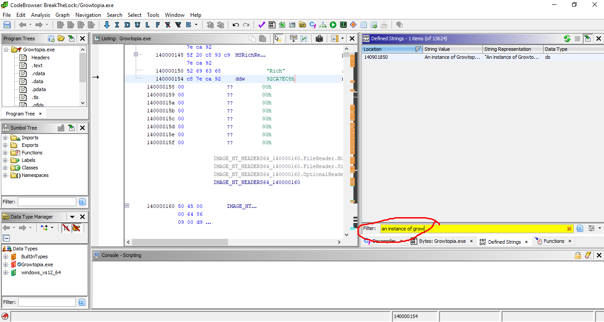
  
- When we click at the ***search result*** we can see that the string is declared in the 
  ***assembly data segment***
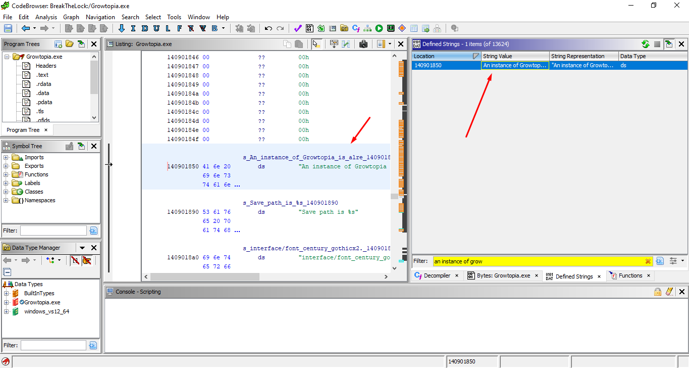

- We can look at the ***references*** to the string in the whole program, so that we will know
  where the strings is used in the ***program*** by ***right clicking*** at the ***assembly of
  the string*** 

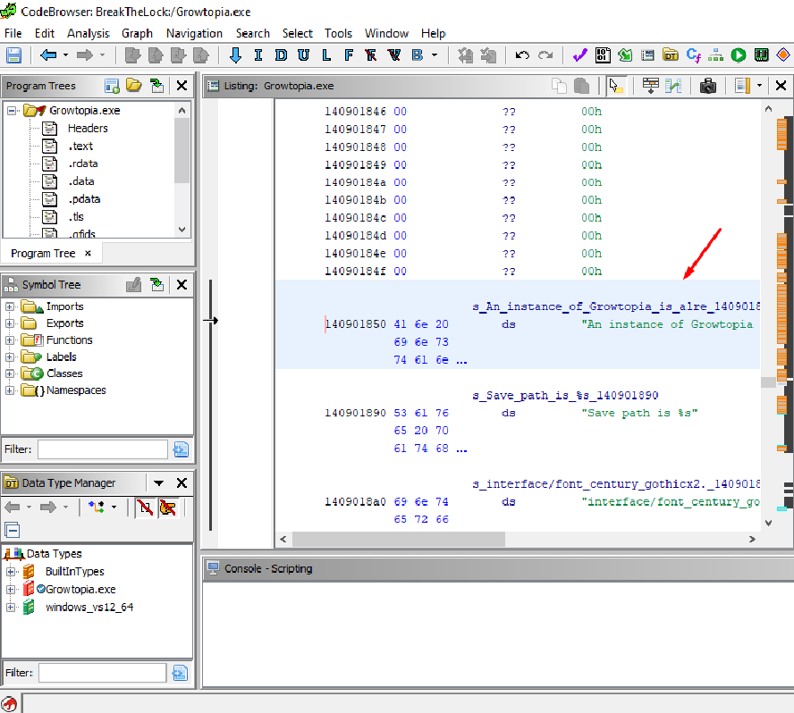

- Then go to ***References->Show References To Address***


- We can see where the ***string*** is  referenced in the program, we can click the 
  ***references*** that ***ghidra*** found to go to the assembly part of the program
  where it is used


- We can select at the instruction and open the ***Decompiler*** window to see the pseudo c like
  decompilation of the assembly so we can get a better view at what the program is doing.

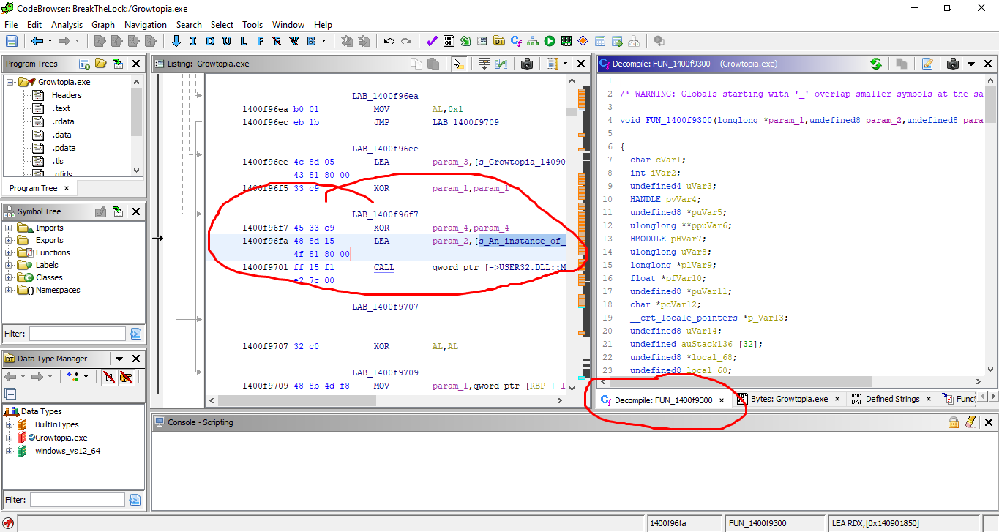

This is what ghidra gives me as the ***decompiled code***, we now know that the code that checks 
for multiple instances is ***somewhere around here***. 

### Decompiled Code
```
/* WARNING: Globals starting with '_' overlap smaller symbols at the same address */

void FUN_1400f9300(longlong *param_1,undefined8 param_2,undefined8 param_3,longlong param_4)

{
  char cVar1;
  int iVar2;
  undefined4 uVar3;
  HANDLE pvVar4;
  undefined8 *puVar5;
  ulonglong **ppuVar6;
  HMODULE pHVar7;
  ulonglong uVar8;
  longlong *plVar9;
  float *pfVar10;
  undefined8 *puVar11;
  char *pcVar12;
  __crt_locale_pointers *p_Var13;
  undefined8 uVar14;
  undefined auStack136 [32];
  undefined8 *local_68;
  undefined8 local_60;
  ulonglong **local_58;
  undefined local_50;
  undefined8 local_40;
  undefined8 local_38;
  ulonglong *local_30 [4];
  ulonglong local_10;
  
  local_60 = 0xfffffffffffffffe;
  local_10 = DAT_140b3e150 ^ (ulonglong)auStack136;
  FUN_1402d14a0();
  FUN_1402d4fa0((longlong)(param_1 + 0x1ce));
  uVar14 = FUN_140042400(0);
  FUN_14002bd60(uVar14,60.0);
  iVar2 = FUN_1400d45e0();
  if ((iVar2 == 2) || (iVar2 == 4)) {
    cVar1 = '\0';
LAB_1400f93ce:
    FUN_1400e6920(cVar1);
  }
  else {
    if (iVar2 == 6) {
      iVar2 = FUN_1400e6460();
      if (((iVar2 != 0x400) || (iVar2 = FUN_1400e6480(), iVar2 != 0x300)) &&
         ((iVar2 = FUN_1400e6480(), iVar2 != 0x400 || (iVar2 = FUN_1400e6460(), iVar2 != 0x300))))
      goto LAB_1400f9374;
    }
    else if (iVar2 != 7) {
LAB_1400f9374:
      cVar1 = '\x01';
      goto LAB_1400f93ce;
    }
    FUN_1400e6920('\0');
    uVar3 = FUN_1400efc30();
    iVar2 = FUN_1400efc20();
    FUN_1400e69b0(iVar2,uVar3,1);
  }
  thunk_FUN_1400d9920(2000);
  if (*(char *)((longlong)param_1 + 0x24a) != '\0') goto LAB_1400f9709;
  pvVar4 = OpenMutexA(0x1f0001,0,"Growtopia");
  if ((pvVar4 == (HANDLE)0x0) &&
     (pvVar4 = CreateMutexA((LPSECURITY_ATTRIBUTES)0x0,0,"Growtopia"), pvVar4 != (HANDLE)0x0)) {
    pcVar12 = "Growtopia";
    uVar14 = 0;
    pvVar4 = OpenMutexA(0x1f0001,0,"Growtopia");
    if (pvVar4 != (HANDLE)0x0) {
      uVar14 = FUN_14002ac60((longlong)param_1,uVar14,pcVar12,param_4);
      if ((char)uVar14 != '\0') {
        puVar5 = (undefined8 *)FUN_1400ee330((ulonglong **)&local_50);
        if (0xf < (ulonglong)puVar5[3]) {
          puVar5 = (undefined8 *)*puVar5;
        }
        FUN_1400efff0((longlong)"Save path is %s",(__crt_locale_pointers *)puVar5,(longlong)pcVar12,
                      param_4);
        FUN_14001dae0((ulonglong **)&local_50);
        local_58 = local_30;
        ppuVar6 = (ulonglong **)FUN_1400ee330(local_30);
        local_38 = 0xf;
        plVar9 = (longlong *)0x0;
        local_40 = 0;
        local_50 = 0;
        FUN_14001de70((ulonglong **)&local_50,(ulonglong **)&PTR_1408ca3a0,(ulonglong *)0x0);
        FUN_1400ed470((ulonglong **)&local_50,ppuVar6);
        ppuVar6 = (ulonglong **)FUN_1400ee330(local_30);
        FUN_1400eecc0(ppuVar6);
        FUN_14001dae0(local_30);
        *(undefined4 *)((longlong)param_1 + 0x44c) = 2;
        *(undefined4 *)((longlong)param_1 + 0x5c4) = 2;
        pHVar7 = GetModuleHandleA((LPCSTR)0x0);
        if (pHVar7 != (HMODULE)0x0) {
          uVar8 = FUN_1400e4380(30000);
          _DAT_140b6c188 = (int)uVar8;
          uVar8 = FUN_1400e33e0((byte *)(pHVar7 + (*(uint *)((longlong)&pHVar7[0xb].unused +
                                                            (longlong)pHVar7[0xf].unused) >> 2)),
                                *(uint *)((longlong)&pHVar7[7].unused + (longlong)pHVar7[0xf].unused
                                         ));
          DAT_140b6c18c = (int)uVar8 + _DAT_140b6c188;
        }
        cVar1 = FUN_1400e64b0();
        local_38 = 0xf;
        local_40 = 0;
        local_50 = 0;
        if (cVar1 == '\0') {
          FUN_14001de70((ulonglong **)&local_50,(ulonglong **)"interface/font_century_gothic.rtfont"
                        ,(ulonglong *)&DAT_00000024);
          cVar1 = FUN_1400968c0((ulonglong)(param_1 + 0x6b),(ulonglong **)&local_50,1,param_4);
          if (cVar1 == '\0') goto LAB_1400f9709;
          local_38 = 0xf;
          local_40 = 0;
          local_50 = 0;
          uVar14 = 0;
          FUN_14001de70((ulonglong **)&local_50,
                        (ulonglong **)"interface/font_century_gothic_big.rtfont",
                        (ulonglong *)&DAT_00000028);
          p_Var13 = (__crt_locale_pointers *)CONCAT71((int7)((ulonglong)uVar14 >> 8),1);
          cVar1 = FUN_1400968c0((ulonglong)(param_1 + 0x9a),(ulonglong **)&local_50,1,param_4);
        }
        else {
          FUN_14001de70((ulonglong **)&local_50,
                        (ulonglong **)"interface/font_century_gothicx2.rtfont",(ulonglong *)0x26);
          cVar1 = FUN_1400968c0((ulonglong)(param_1 + 0x6b),(ulonglong **)&local_50,1,param_4);
          if (cVar1 == '\0') goto LAB_1400f9709;
          local_38 = 0xf;
          local_40 = 0;
          local_50 = 0;
          uVar14 = 0;
          FUN_14001de70((ulonglong **)&local_50,
                        (ulonglong **)"interface/font_century_gothic_bigx2.rtfont",(ulonglong *)0x2a
                       );
          p_Var13 = (__crt_locale_pointers *)CONCAT71((int7)((ulonglong)uVar14 >> 8),1);
          cVar1 = FUN_1400968c0((ulonglong)(param_1 + 0x9a),(ulonglong **)&local_50,1,param_4);
        }
        if (cVar1 != '\0') {
          iVar2 = FUN_1400e43b0(0x143,0x9f6);
          DAT_140b35654 = (undefined2)iVar2;
          (**(code **)(*param_1 + 0x48))(param_1);
          FUN_1400fb7a0((longlong)param_1);
          local_68 = (undefined8 *)operator_new(0x60);
          if (local_68 != (undefined8 *)0x0) {
            plVar9 = FUN_14009cd60(local_68);
          }
          FUN_14009a830((longlong)&DAT_140b6c1d8,plVar9,p_Var13,param_4);
          FUN_1403ff420();
          pfVar10 = FUN_1400e6430((float *)&local_68);
          puVar5 = (undefined8 *)FUN_1400e2100((ulonglong **)&local_50,pfVar10);
          puVar11 = (undefined8 *)FUN_1400ee000(local_30);
          if (0xf < (ulonglong)puVar5[3]) {
            puVar5 = (undefined8 *)*puVar5;
          }
          if (0xf < (ulonglong)puVar11[3]) {
            puVar11 = (undefined8 *)*puVar11;
          }
          FUN_1400efff0((longlong)"Current locale is %s, screen size is %s",
                        (__crt_locale_pointers *)puVar11,(longlong)puVar5,param_4);
          FUN_14001dae0(local_30);
          FUN_14001dae0((ulonglong **)&local_50);
          FUN_1403fed50();
        }
      }
      goto LAB_1400f9709;
    }
  }
  MessageBoxA((HWND)0x0,"An instance of Growtopia is already running!  Go play that one.",
              "Growtopia",0);
LAB_1400f9709:
  FUN_1407ef730(local_10 ^ (ulonglong)auStack136);
  return;
}

```
## 7. Understanding the validator
In this section, we will try to understand how it checks for multiple instances from the 
[decompiled code](#decompiled-code) that we got from the previous section. 

after looking at the decompiled code we notice that at the bottom that there 
is a function which will display the warning that multiple instances are running
which is
```
  MessageBoxA((HWND)0x0,"An instance of Growtopia is already running!  Go play that one.",
              "Growtopia",0);
```
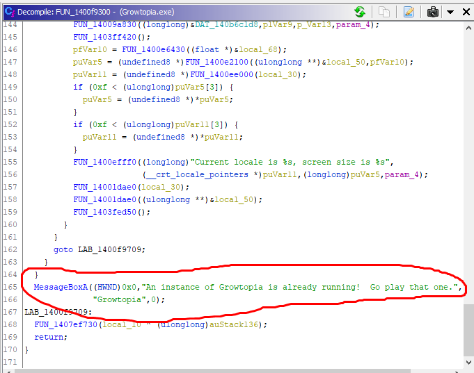

Now that we have found the corresponding code that displays the warning, the next step 
is to try to trace back on how/where  the warning is called. 

when we look back at the [decompiled code](#decompiled-code) we know that if the ***if condition
is true*** then it will initialize the game properly, ***else*** it will display the warning
box which will prevent us from opening multiple windows of ***growtopia***.
 
```
  pvVar4 = OpenMutexA(0x1f0001,0,"Growtopia");
  if ((pvVar4 == (HANDLE)0x0) &&
     (pvVar4 = CreateMutexA((LPSECURITY_ATTRIBUTES)0x0,0,"Growtopia"), pvVar4 != (HANDLE)0x0)) 
```
from the code above, we know that it is using the win api 
[CreateMutexA][CreateMutexA_link] and [OpenMutexA][OpenMutexW_link] to check for 
multiple instances, they are the ***most common way*** for 
a windows program to check for multiple instances 
described [here][prevent_multiple_instance_link]

### [CreateMutexA][CreateMutexA_link]
> Creates or opens a named or unnamed mutex object.

Function signature

```
HANDLE CreateMutexA(
  [in, optional] LPSECURITY_ATTRIBUTES lpMutexAttributes,
  [in]           BOOL                  bInitialOwner,
  [in, optional] LPCSTR                lpName
);
```

### [OpenMutexA][OpenMutexW_link]

> Opens an existing named mutex object.

```
HANDLE OpenMutexW(
  [in] DWORD   dwDesiredAccess,
  [in] BOOL    bInheritHandle,
  [in] LPCWSTR lpName
);
```

#### Return value
> If the function succeeds, the return value is a handle to the mutex object.
> 
> If the function fails, the return value is NULL. To get extended error information, call GetLastError.
> 
> If a named mutex does not exist, the function fails and GetLastError returns ERROR_FILE_NOT_FOUND

### What we understood so far

according to the documentation, if `OpenMutexA` fails because no previous mutex was ***created***
then it will ***return NULL***.
so we can add a summary in this section of the [decompiled code](#decompiled-code)
```
  pvVar4 = OpenMutexA(0x1f0001,0,"Growtopia");
  if ((pvVar4 == (HANDLE)0x0) &&
     (pvVar4 = CreateMutexA((LPSECURITY_ATTRIBUTES)0x0,0,"Growtopia"), pvVar4 != (HANDLE)0x0)) 
```

and ***the summary of the validator*** is as follow 
```
first try to open a mutex then check if it returns null
only create a new mutex if the return value of OpenMutexA is NULL
if pvVar4 is not null, then a mutex is previously created 
then it will display the error message 
instead of initializing the game
```


## 8. Bypassing the validator

In this step we are going to bypass the ***validator*** via 
[binary patching][binary_patching_link] by disabling/ignoring
```
if((pvVar4 == (HANDLE)0x))
```
In doing so the program will create a new ***mutex*** 
regardless of the conditional statement.

- We can view the ***corresponding assembly and the decompiled code*** of the validator by 
selecting it as shown in the picture below


- In the assembly instruction `JNZ LAB_1400f96f7` it will jump to the instruction address of 
  the error display when `pvVar4 == (HANDLE)0x0` is false
  we can go to the instruction pointed by the ***label*** by 
  double clicking ***LAB_1400f96f7***

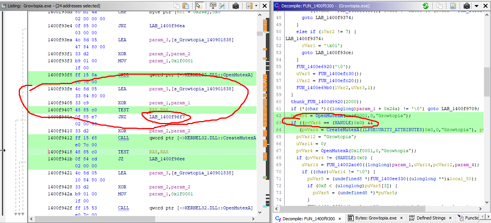


- We can rename ***LAB_1400f96f7*** to have a more descriptive name like 
  `LAB_WARNING_MULTIPLE_INSTANCE` by right clicking the ***label*** at the 
  ***listing window*** 


- then click ***Edit Label...***, enter the name then click ***ok***

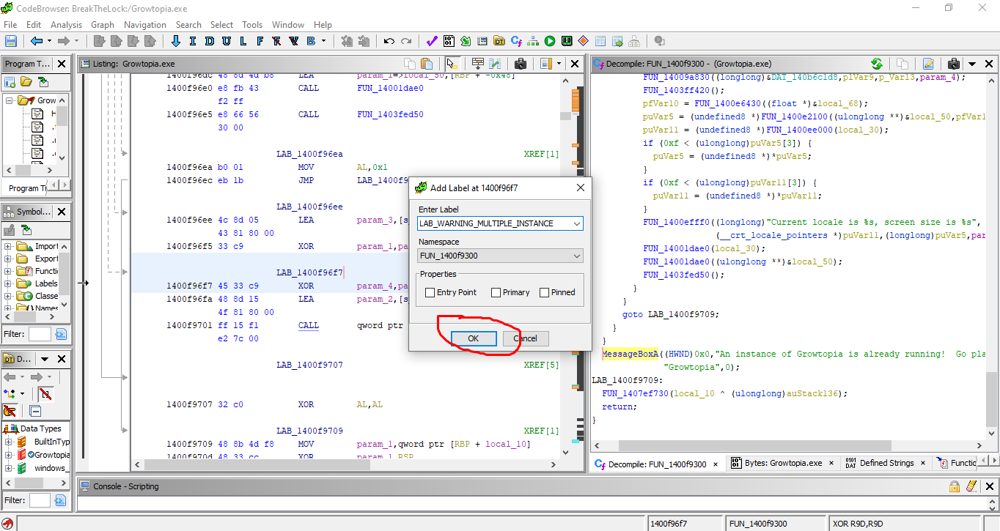

- Now we can see that the ***label*** has been changed 


- we will disable `pvVar4==(HANDLE)0x0` by making an `unconditional jump` 
  so that `pvVar4==(HANDLE)0x0` will be ignored and jump to 
  `pvVar4 = CreateMutexA((LPSECURITY_ATTRIBUTES)0x0,0,"Growtopia")` straight away
	- first right click at `JNZ LAB_WARNING_MULTIPLE_INSTANCE` and click 
 	  ***Patch Instruction***
		
	- wait for ghidra to make the ***assembler*** for us (might take a while)
		
	- After the process is finished we can patch the assembly instruction as shown
	  below,
		
	- We will patch the instruction from `JNZ` to `JMP` for unconditional jump, then
	  it will jump to the next instruction which is at address ***1400f9410***
		
	- In the image above, ghidra will show us the recommended ***binary instructions*** 
 	  that ***ghidra*** will replace it with, we will choose the ***first option*** then
	  click ***ok***
	  (usually replacing an instruction with another instruction that has different 
	  length will make it ***unstable*** and ***might break*** the program)
	  
- After the ***patch*** we can see how the ***assembly*** and the ***decompiled code***
  is changed, which results in `pvVar4==(HANDLE)0x0` being ***removed*** 

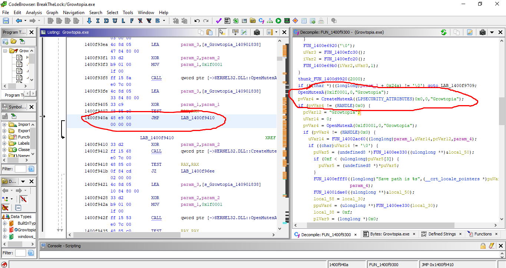

Now the program will always create a new ***instance*** regardless if a mutex is ***created***
previously.


## 9.Exporting the program and testing it out

Now that we have ***patched*** the binary, we will need to export the program to 
use ***modified*** version.

- click ***file->Export Program...***


- change the ***Format*** to ***Binary*** then select where you want it to be ***saved***

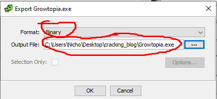

- Now lets go to the folder which we have ***saved*** the modified binary, we notice that the 
  name has a `.bin` at the end, so we will need to ***remove*** it in order for it to become
  ***a normal executable***


- Then we will ***replace*** the original ***Growtopia.exe*** with the ***modified version***


- When we try to open ***Growtopia*** we can see that we have sucessfully ***reverse
  engineered*** the game because we can open more than 1 instance now :) .
 


- We can even play ***multiple accounts*** in the same computer, which I assume that the 
  dev teams have missed this ***vulnerability*** 

  

# Resources

You can download the ghidra project which you can import in ghidra [here][tutorial_resources] 
to download `SavedData.zip` then unzip it to get `ghidra_project.gar`.


# Editing The article
this article is written in markdown, and to view the markdown some packages need to be installed 

## Setup
[python][python_link] and [pip][pip_link] needs to be installed on your system
### ubuntu
```
# install python  
sudo apt install python3 
# install pip 
apt-get install python3-pip
# install pip package to render markdown
pip install grip
```

## rendering the article
run `render.sh` to render the article (only needed once)


[//]: # (Common Links used by this article)
[ghidra_link]: https://github.com/NationalSecurityAgency/ghidra
[ghidra_installation_link]: https://ghidra-sre.org/
[CreateMutexA_link]: https://docs.microsoft.com/en-us/windows/win32/api/synchapi/nf-synchapi-createmutexa
[OpenMutexW_link]: https://docs.microsoft.com/en-us/windows/win32/api/synchapi/nf-synchapi-openmutexw
[pip_link]: https://pypi.org/project/pip/
[python_link]: https://www.python.org/
[tutorial_installer_link]: https://github.com/ShiromiTempest/growtopia_cracked/releases/tag/v.1.0.0

[growtopia_link]: https://www.growtopiagame.com/
[tutorial_resources]: https://github.com/ShiromiTempest/growtopia_cracked/releases/tag/v.1.0.0
[visual_studio_link]: https://visualstudio.microsoft.com/

[article_comments_section_link]: https://github.com/ShiromiTempest/growtopia_cracked/issues/1
[article_issue_link]: https://github.com/ShiromiTempest/growtopia_cracked/issues
[growtopia_wikipedia_link]: https://en.wikipedia.org/wiki/Growtopia
[rtsoft_github_link]: https://github.com/SethRobinson
[proton_link]: https://github.com/SethRobinson/proton
[win_api_wikipedia_link]: https://en.wikipedia.org/wiki/Windows_API
[MessageBoxA_link]: https://docs.microsoft.com/en-us/windows/win32/api/winuser/nf-winuser-messageboxa
[prevent_multiple_instance_link]: https://stackoverflow.com/questions/8799646/preventing-multiple-instances-of-my-application
[binary_patching_link]: https://en.wikipedia.org/wiki/Patch_(computing)
