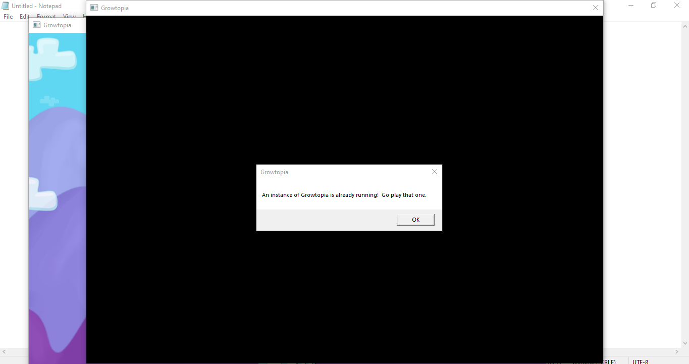
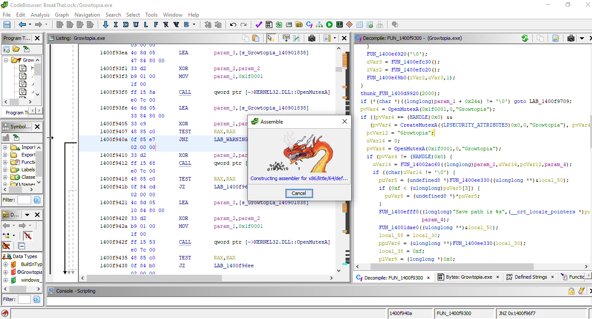
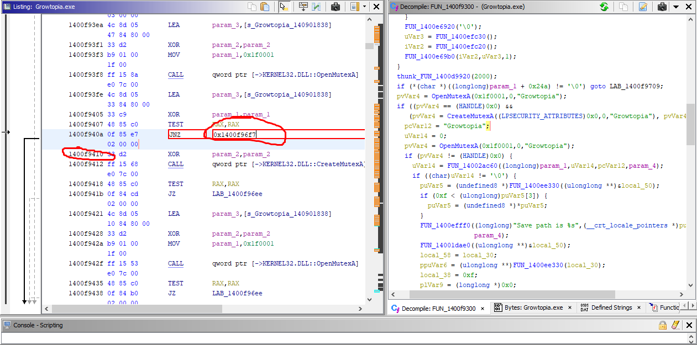

# Turtorial
In this turtorial I will show you how to reverse engineer a game(growtopia)

# Why?
In the game you can't open a multiple instances of the game, so that you can't play with multiple
accounts on the same device, so lets try to ***reverse engineer*** the game to achieve this functionality


# Requirements
To understand/follow along this article things listed here is required
- basic knowledge of x86 assembly 
- some knowledge about how if else statements work at the low level
- experience in [C programming language](https://en.wikipedia.org/wiki/C_(programming_language))
- [ghidra](https://github.com/NationalSecurityAgency/ghidra) software
- Windows OS


# Turtorials

## Turtorials Table Of contents
- [Overview](#1overview)

- [game and ghidra installation](#2game-and-ghidra-installation)


```
Notes : 
this functions names that I mentioned in the article, in the microsoft docs or by the ghidra decompiler are the same and interexchangeable
I mention this because the microsoft docs and the output from the ghidra decompiler are different in naming both of this functions

OpenMutexW == OpenMutexA
CreateMutexW == CreateMutexA
```
## 1.Overview

In this turtorial we will try to break the validator as shown in [Why? Section](#why) using [reverse engineering](https://en.wikipedia.org/wiki/Reverse_engineering) techniques
with the [ghidra framework][ghidra_link]


A common way and easy way to check if a windows program is running with multiple instances is by using 
the win32 api [CreateMutexA][CreateMutexA_link] and [OpenMutexW][OpenMutexW_link], 


this is a pseudo code of how the program achieve this
```
  // if OpenMutexA fails because no mutex object has been prevously created 
  // then it will return NULL 
  // so to check if multiple instances are running, it can be done this way
  // which won't create new mutex if the mutex has been created previously
  program_handle = OpenMutexA(0x1f0001,0,"Growtopia");
  if ((program_handle == (HANDLE)0x0))
	program_handle = CreateMutexA((LPSECURITY_ATTRIBUTES)0x0,0,"Growtopia");

```

We can remove the lock by trying to make an unconditional jump by patching the binary at 
```
  if ((program_handle == (HANDLE)0x0))
```
with ghidra's disassembler to jump straight to 

```
program_handle = CreateMutexA((LPSECURITY_ATTRIBUTES)0x0,0,"Growtopia");
```
So that It will initialize the game regardless if a mutex for "Growtopia" has been created or not

### Example Of Patching Binary Via Modifying The Assembly 








after the "lock" has been **disabled**, we can play Growtopia on multiple windows with multiple accounts simultaneously


## 2.Game And Ghidra Installation
Before starting this turtorial, we need to install both of the game and ghidra

### ghidra installation
head over to [ghidra][ghidra_installation_link] and look at the [installation guide](https://htmlpreview.github.io/?https://github.com/NationalSecurityAgency/ghidra/blob/stable/GhidraDocs/InstallationGuide.html)

### growtopia installation

which can be installed [here][turtorial_resources] to install `SavedData.zip` then extract the zip to get the ***growtopia installer*** to install the game.

### 3. Importing the game to ghidra
To prepare for analysing the binary, we need to import it to ghidra

1.open ***ghidra*** then go to ***file->New Project ...*** 


# Editing The article
this article is written in markdown, and to view the markdown some packages need to be installed 

## Setup
[python][python_link] and [pip][pip_link] needs to be installed on your system
### ubuntu
```
# install python  
sudo apt install python3 
# install pip 
apt-get install python3-pip
# install pip package to render markdown
pip install grip
```

## rendering the article
run `render.sh` to render the article (only needed once)


[//]: # (Common Links used by this article)
[ghidra_link]: https://github.com/NationalSecurityAgency/ghidra
[ghidra_installation_link]: https://ghidra-sre.org/
[CreateMutexA_link]: https://docs.microsoft.com/en-us/windows/win32/api/synchapi/nf-synchapi-createmutexa
[OpenMutexW_link]: https://docs.microsoft.com/en-us/windows/win32/api/synchapi/nf-synchapi-openmutexw
[pip_link]: https://pypi.org/project/pip/
[python_link]: https://www.python.org/
[turtorial_installer_link]: https://github.com/ShiromiTempest/growtopia_cracked/releases/tag/v.1.0.0

[growtopia_link]: https://www.growtopiagame.com/
[turtorial_resources]: https://github.com/ShiromiTempest/growtopia_cracked/releases/tag/v.1.0.0
